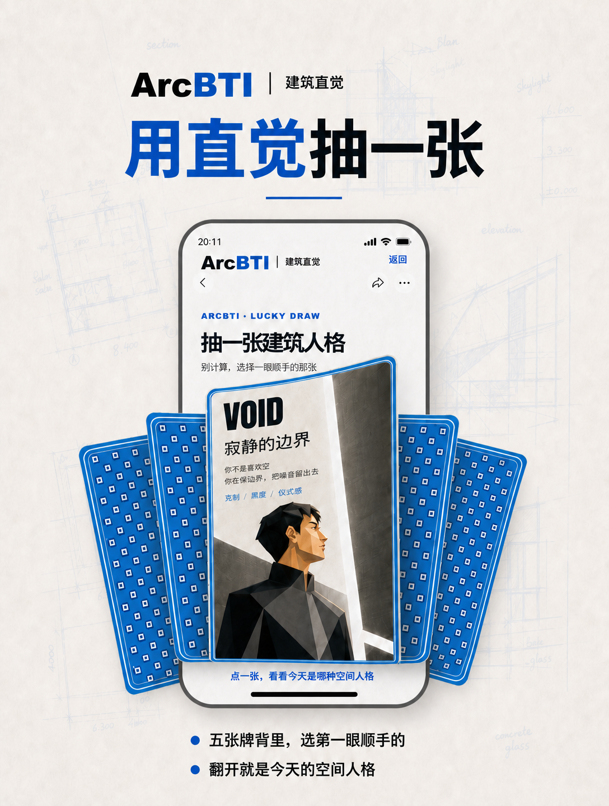
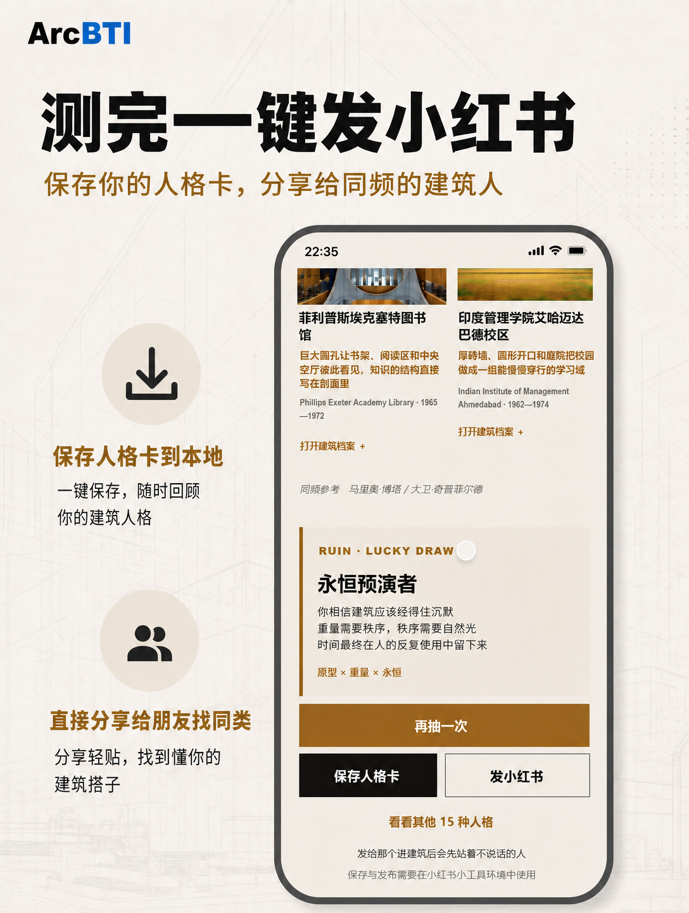

# ArcBTI｜建筑直觉测试

ArcBTI 把建筑史、空间感知和人格测试装进一个移动端优先的小工具：认真回答 18 道题，或者凭第一眼抽一张牌，获得 16 种建筑人格之一。

**[在线体验](https://luke20001024.github.io/AIBTI/)** · **[下载 GitHub Pages Web 完整包](https://github.com/Luke20001024/AIBTI/raw/main/releases/ArcBTI-github-pages-web-v1.zip)** · **[下载完整源代码](https://github.com/Luke20001024/AIBTI/archive/refs/heads/main.zip)**

<p align="center">
  
</p>

## 两种玩法

- **18 题测试**：从空间本能、秩序偏好、材料感知和公共关系逐步定位建筑人格。
- **随手抽一张**：从五张牌中选第一眼顺手的一张，翻牌后直接进入今天的建筑人格。

<p align="center">
  
  
</p>

## 16 种人格，不止一张结果卡

每个结果页都使用同一套高密度移动端叙事框架，同时按人格主题改变色彩、首图与内容：

1. 先用一句人话解释你的空间本能。
2. 介绍代表建筑师及其方法，而不是只贴一个名字。
3. 用三座主要建筑说明判断，每座建筑档案保留 2–3 张图片。
4. 补充两座同频建筑，并提供建筑师与建筑弹层。
5. 支持再次抽卡、直接下载人格卡，以及浏览其他 15 种人格。

<p align="center">
  
  
</p>

<p align="center">
  
</p>

## GitHub Pages Web 专版

当前 GitHub Pages 使用独立的 Web 构建目标，不再复用小红书运行时：

- 结果页只保留一个 **保存人格卡** 按钮，浏览器会直接下载当前人格海报。
- 16 张人格首图分别校正顶部有效内容位置，TIDE、RUIN 等页面不再出现空白带。
- 首页提供 **去 GitHub 加星** 与 **留言与建议** 两个克制的社区入口。
- 留言入口使用仓库的 GitHub Issue Form；登录 GitHub 后即可提交反馈。
- 保留完整测试流、抽卡、人物与建筑档案、图库弹层、再次抽卡和人格目录。

## 下载完整程序

### GitHub Pages Web 完整包

下载：**[ArcBTI-github-pages-web-v1.zip](https://github.com/Luke20001024/AIBTI/raw/main/releases/ArcBTI-github-pages-web-v1.zip)**

- ZIP 内是可独立部署的完整静态站点，不需要 Node.js、数据库或服务器端运行时。
- 解压后包含 `index.html`、完整交互脚本、样式与全部运行图片。
- 可放到 GitHub Pages、对象存储、CDN 或任意静态 Web 服务。
- 文件数量、体积和 SHA256 见 [`releases/SHA256SUMS.txt`](releases/SHA256SUMS.txt)。
- 完整验收结果见 [`releases/ArcBTI-github-pages-web-v1-validation.md`](releases/ArcBTI-github-pages-web-v1-validation.md)。

### 完整源代码

- GitHub 页面右上角选择 **Code → Download ZIP**。
- 或直接下载：[main 分支完整源码 ZIP](https://github.com/Luke20001024/AIBTI/archive/refs/heads/main.zip)。
- 当前正式分支：`main`。
- GitHub Pages 每次从 `main` 自动构建，不依赖仓库中预先生成的 `dist` 目录。

### 小红书小工具包保持独立

GitHub Pages Web 专版和小红书小工具包是两个隔离的构建目标。本次 Web 改动不会覆盖或改写原小红书 ZIP；小红书包仍保留其保存、发布桥接与平台约束。原本地交付包的校验信息为：

- 文件：`ArcBTI-xhs-mini-tool-seamless-home-v6-20260901.zip`
- 大小：8,914,212 bytes
- SHA256：`83F55C0A10DA6DD4EE258D6D4CDFB07DD948D6BB644530C8192D35173228E620`

## 本地运行 Web 完整包

解压 `ArcBTI-github-pages-web-v1.zip` 后，可直接打开 `index.html`。为了得到更接近手机 Web 的表现，推荐在解压目录启动静态服务器：

```bash
python -m http.server 8000
```

然后访问 `http://127.0.0.1:8000/`。

## 从源码构建

要求 Node.js 22、pnpm 11、Python 3.12 与 Pillow。

安装依赖并构建 GitHub Pages Web 专版（PowerShell）：

```powershell
pnpm install --frozen-lockfile
$env:ARCBTI_RELEASE_TARGET = "web"
$env:ARCBTI_OUTPUT_DIR = "web-release/dist"
node xhs-mini-tool-v2/scripts/build.mjs
node xhs-mini-tool-v2/scripts/validate.mjs
node xhs-mini-tool-v2/scripts/offline-smoke.mjs
node xhs-mini-tool-v2/scripts/web-mobile-qa.mjs
```

生成目录为 `web-release/dist`。

构建小红书目标时不设置上述环境变量，输出仍为 `xhs-mini-tool-v2/dist`；两个输出目录不会互相覆盖。

## 当前交付范围

- 16/16 人格结果页与 16 张人物首图。
- 18 道正式测试题与完整评分内容。
- 16 组代表建筑师内容。
- 80 个主要建筑引用与 131 个建筑图库引用。
- 首页测试与抽卡双入口、五张牌翻牌动画、再次抽卡。
- 人物档案、建筑档案、直接下载人格卡和 4 × 4 人格目录。
- 首页 GitHub Star 与 Issue Form 留言入口。
- 手机安全区、触控目标、弹层滚动、无横向溢出与图片固有比例适配。

## 仓库目录

- `xhs-mini-tool-v2/src/`：当前独立小工具 HTML、TypeScript 与 CSS。
- `xhs-mini-tool-v2/scripts/`：构建、图片优化、校验和移动端验收脚本。
- `src/content/`：人格、建筑师、建筑、问题与评分内容源。
- `public/images/`：人物、建筑与界面原始素材。
- `docs/showcase/`：本 README 使用的六张产品展示图。
- `releases/`：可直接下载的 Web 完整 ZIP、SHA256 与验收报告。
- `.github/ISSUE_TEMPLATE/`：主页留言入口使用的 GitHub Issue Form。
- `.github/workflows/deploy-pages.yml`：GitHub Pages 自动构建与发布工作流。

## 部署与质量门禁

推送到 `main` 后，GitHub Actions 会依次执行：

1. TypeScript 类型检查与内容测试。
2. GitHub Pages Web 专版构建与图片优化。
3. 16 人格、18 题、建筑师、建筑和媒体引用完整性校验。
4. Android Chromium 与 iPhone WebKit 双内核手机验收。
5. 检查首页 GitHub 社区入口、结果页直接下载、TIDE/RUIN 首图和横向溢出。
6. 将 `web-release/dist` 原子部署到 GitHub Pages。

线上地址：<https://luke20001024.github.io/AIBTI/>

## 素材说明

建筑与人物资料来源集中列在各结果页的资料索引和设计登记文件中。当前项目记录了来源，但不等同于完成商业授权；公开商业使用前仍需逐张复核图片许可、署名和使用范围。
