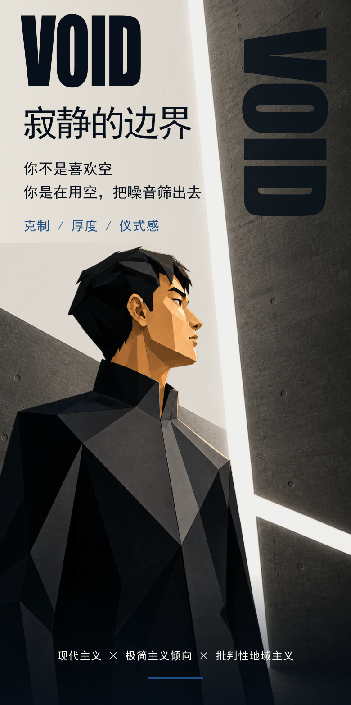
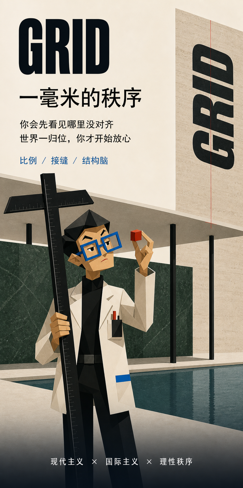
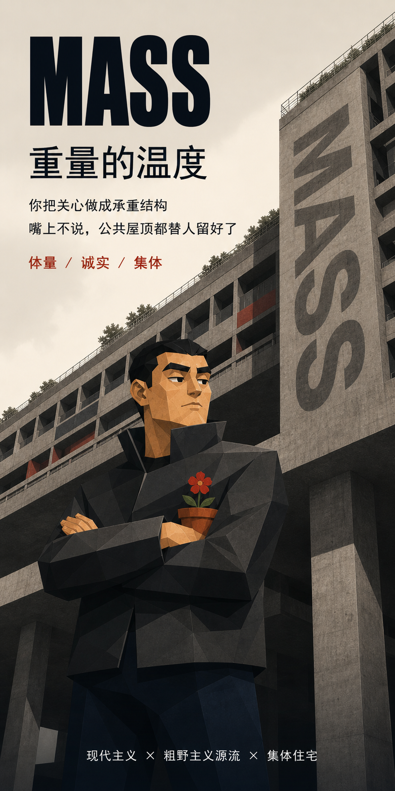
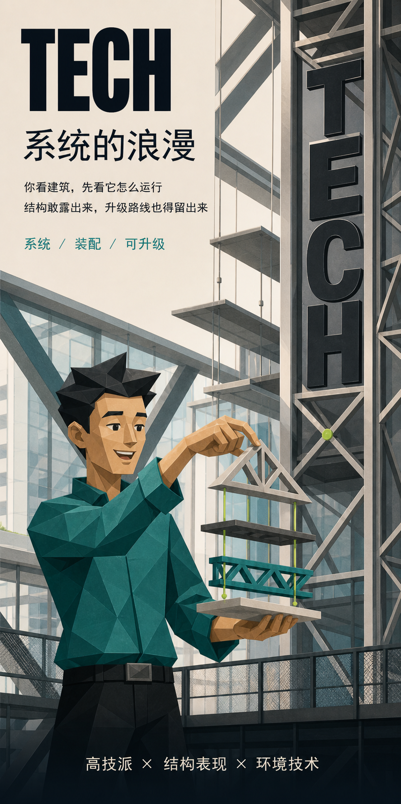
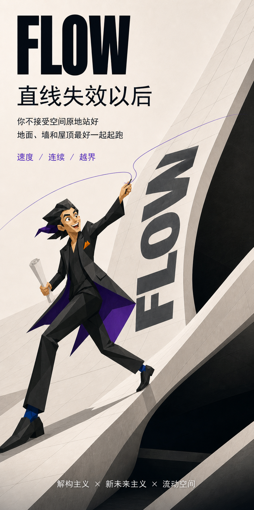
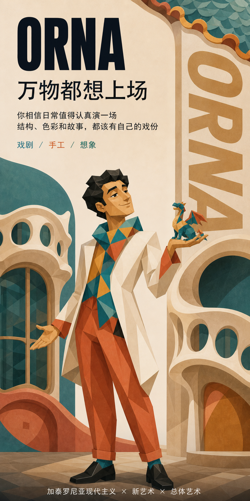
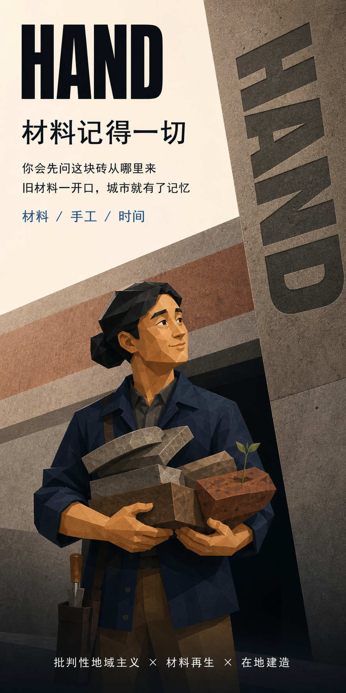

# ArcBTI 八人格首屏概念索引

## V2 / 当前推荐角色系统

V2 保留 GRID 与 VOID，FLOW 与 HAND 改为女性角色，ROOT、MASS、TECH、ORNA 重新抽象面部

### V2 单图

- GRID：[继续使用 V1](./concepts/GRID-hero-v1.png)
- ROOT：[多边形面部 V2](./concepts/ROOT-hero-v2.png)
- MASS：[多边形面部 V2](./concepts/MASS-hero-v2.png)
- VOID：[继续使用现有基准](../../../public/images/void-v2/persona/void-hero-poster-v4.png)
- TECH：[多边形面部 V2](./concepts/TECH-hero-v2.png)
- FLOW：[女性角色 V2](./concepts/FLOW-hero-v2.png)
- ORNA：[多边形面部 V2](./concepts/ORNA-hero-v2.png)
- HAND：[女性角色 V2](./concepts/HAND-hero-v2.png)

角色改造依据见 [角色系统 V2 改造计划](./character-system-v2-plan.md)

V2 提示词见 [角色系统 V2 提示词集](./character-system-v2-prompt-set.md)

V2 验收见 [角色系统 V2 视觉验收](./character-system-v2-visual-qa.md)

## V1 / 初始八人格总览

以下总览统一缩放到真实手机比例，用于判断家族感、人物张力与人格间的可辨识度

## V1 基准

### VOID / 寂静的边界

## V1 新增人格

### GRID / 一毫米的秩序

### ROOT / 地形的回声

### MASS / 重量的温度

### TECH / 系统的浪漫

### FLOW / 直线失效以后

### ORNA / 万物都想上场

### HAND / 材料记得一切

详细设计依据见 [八人格结果卡扩展规划](./8-persona-expansion-plan.md)

生成记录见 [首屏视觉生成清单](./hero-generation-manifest.md)

提示词结构见 [首屏图像提示词集](./hero-prompt-set.md)

视觉验收见 [首屏视觉验收记录](./visual-qa.md)
